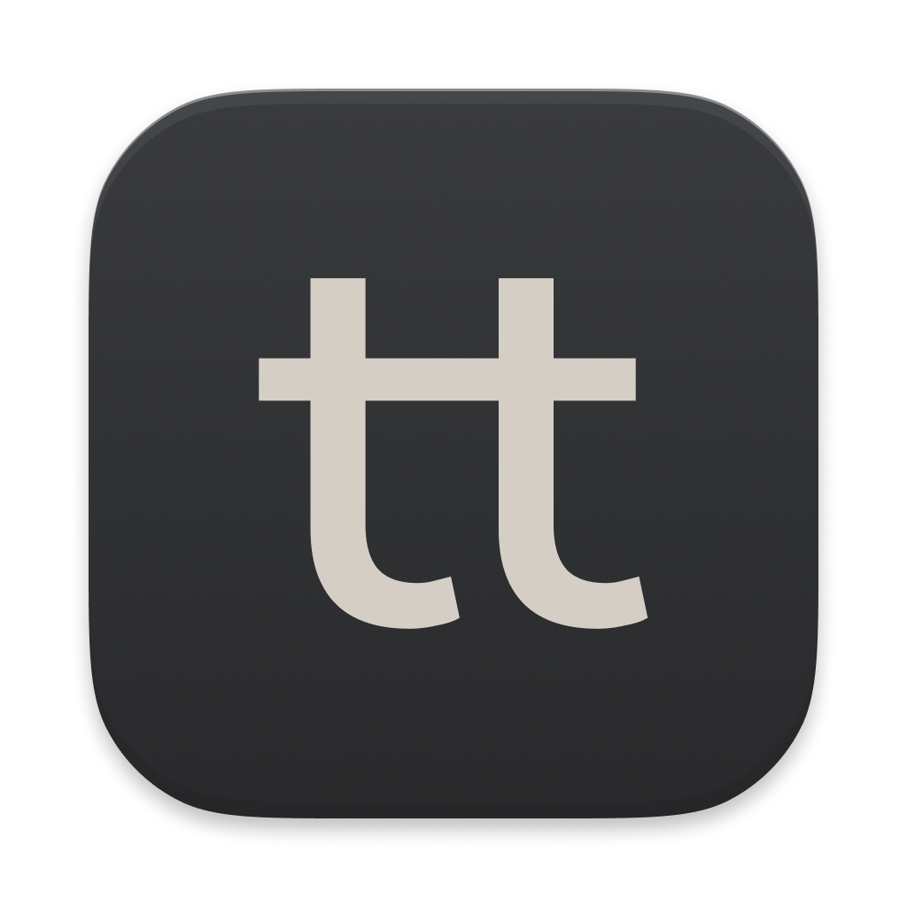

# Tetra



A macOS menu bar app that transforms selected text using custom commands.

Press a global hotkey (default: Ctrl+Option+T), pick a command from a searchable list, and the transformed text replaces your selection. Ships with basics like uppercase, lowercase, and trim — add your own by dropping scripts into `~/.config/tetra/commands/`.

Commands can be written in Bash, Python, Ruby, or Node. They receive text via stdin and output the result to stdout. A local HTTP API (`localhost:24100`) is also available for programmatic access.

Requires macOS 15+. Built with Swift and SwiftUI.

**Website:** https://apps.vlad.studio/tetra

## API

Tetra runs an HTTP server on `localhost:24100` for programmatic access.

**`GET /commands`** — list available commands:
```bash
curl http://localhost:24100/commands
# ["Fix grammar", "Lowercase", "Trim", "Uppercase"]
```

**`POST /transform`** — run a command on text:
```bash
curl -X POST http://localhost:24100/transform \
  -H "Content-Type: application/json" \
  -d '{"command": "Uppercase", "text": "hello"}'
# {"result": "HELLO"}
```

An optional `env` field passes extra environment variables to the command script:
```bash
curl -X POST http://localhost:24100/transform \
  -H "Content-Type: application/json" \
  -d '{"command": "Fix grammar", "text": "helo wrld", "env": {"STEN_CONTEXT": "Dear colleague"}}'
```

## Configuration

Edit `~/.config/tetra/config.json`. Each provider is exposed to commands as `TETRA_<NAME>_URL` and `TETRA_<NAME>_KEY` environment variables. Put your API keys directly in the config file.

```json
{
  "hotkey": "ctrl+option+t",
  "server": { "port": 24100 },
  "providers": {
    "ollama":      { "baseUrl": "http://localhost:11434/v1" },
    "openai":      { "baseUrl": "https://api.openai.com/v1",                              "apiKey": "sk-..." },
    "anthropic":   { "baseUrl": "https://api.anthropic.com",                               "apiKey": "sk-ant-..." },
    "openrouter":  { "baseUrl": "https://openrouter.ai/api/v1",                            "apiKey": "sk-or-..." },
    "gemini":      { "baseUrl": "https://generativelanguage.googleapis.com/v1beta/openai",  "apiKey": "AIza..." },
    "groq":        { "baseUrl": "https://api.groq.com/openai/v1",                          "apiKey": "gsk_..." },
    "mistral":     { "baseUrl": "https://api.mistral.ai/v1",                               "apiKey": "..." },
    "deepseek":    { "baseUrl": "https://api.deepseek.com/v1",                             "apiKey": "sk-..." }
  }
}
```

Only include the providers you use. Ollama needs no API key.

## Commands

Drop scripts into `~/.config/tetra/commands/`. The filename (minus extension) becomes the command name. Scripts receive text via stdin and output the result to stdout. Any language works — Bash, Python, Ruby, Node, or anything else you have installed. Here are some examples:

### Local (no LLM)

`Uppercase.sh` / `Lowercase.sh` / `Trim.sh`:
```bash
#!/bin/bash
tr '[:lower:]' '[:upper:]'
```

### LLM-powered (OpenAI-compatible)

Most providers (OpenAI, Ollama, OpenRouter, Gemini, Groq, Mistral, DeepSeek) share the same API. Change the env var prefix and model to switch providers. Requires `jq` (`brew install jq`).

`Fix grammar.sh` — supports an optional `STEN_CONTEXT` env var for context-aware corrections (passed by [Sten](https://github.com/vladstudio/sten) and other apps via the `/transform` API's `env` field):
```bash
#!/bin/bash
CONTEXT="${STEN_CONTEXT:-}"
SYSTEM="You are given a speech-to-text transcription. Correct grammar, spelling, and misrecognized words. OUTPUT ONLY THE CORRECTED TEXT."
[ -n "$CONTEXT" ] && SYSTEM="${SYSTEM} Consider nearby text for context: ${CONTEXT}"

jq -Rsn --arg t "$(cat)" --arg s "$SYSTEM" '{
  model: "gemma3:4b",
  messages: [{role:"system", content:$s}, {role:"user", content:$t}],
  temperature: 0.3
}' | curl -s "${TETRA_OLLAMA_URL:-http://localhost:11434/v1}/chat/completions" \
  -H "Content-Type: application/json" ${TETRA_OLLAMA_KEY:+-H "Authorization: Bearer $TETRA_OLLAMA_KEY"} -d @- \
| jq -r '.choices[0].message.content // empty'
```

`Translate.sh` (using OpenRouter):
```bash
#!/bin/bash
jq -Rsn --arg t "$(cat)" '{
  model: "openai/gpt-4.1-mini",
  messages: [{role:"system", content:"Translate to English. Return ONLY the translated text."},
             {role:"user", content:$t}],
  temperature: 0.3
}' | curl -s "$TETRA_OPENROUTER_URL/chat/completions" \
  -H "Content-Type: application/json" -H "Authorization: Bearer $TETRA_OPENROUTER_KEY" -d @- \
| jq -r '.choices[0].message.content // empty'
```

### LLM-powered (Anthropic)

Anthropic uses a different API format:

`Summarize.sh`:
```bash
#!/bin/bash
jq -Rsn --arg t "$(cat)" '{
  model: "claude-sonnet-4-20250514",
  max_tokens: 4096,
  messages: [{role:"user", content: ("Summarize concisely:\n\n" + $t)}]
}' | curl -s "$TETRA_ANTHROPIC_URL/v1/messages" \
  -H "Content-Type: application/json" -H "x-api-key: $TETRA_ANTHROPIC_KEY" -H "anthropic-version: 2023-06-01" -d @- \
| jq -r '.content[0].text // empty'
```
