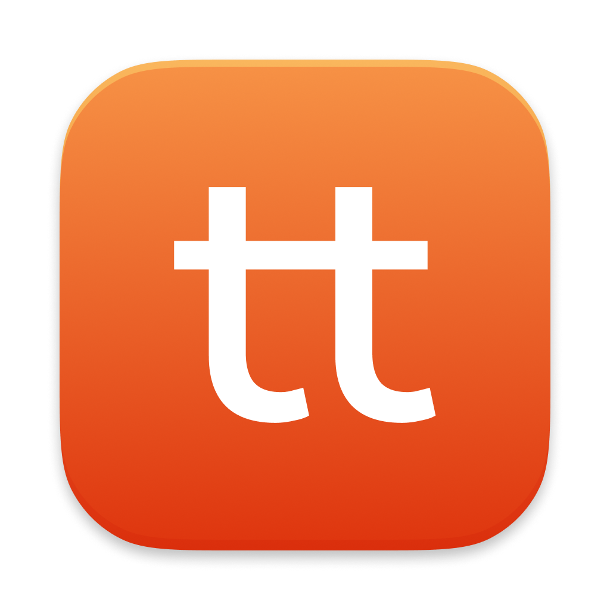

# Tetra: [te]xt [tra]nsormation



A macOS menu bar app that transforms selected text — fix typos, change case, summarize, translate, write commit messages, anything you can describe. Built with Swift.

Requires macOS 15 (Sequoia) or later.

## Install

1. Open **Terminal** (press ⌘Space, type "Terminal", press Enter)
2. Copy and paste this command, then press Enter:

```sh
/bin/bash -c "$(curl -fsSL https://raw.githubusercontent.com/vladstudio/tetra/main/install.sh)"
```

3. The app will install to /Applications and open automatically
4. On first launch, Tetra will ask for **Accessibility** access in System Settings — this is required to grab text from other apps

### Using with Sten?

If you want AI transforms inside [Sten](https://github.com/vladstudio/sten) (voice-to-text), use the combined installer — it sets up both apps, seeds starter commands, and configures an LLM provider in one go:

```sh
/bin/bash -c "$(curl -fsSL https://raw.githubusercontent.com/vladstudio/sten/main/install-with-tetra.sh)"
```

## How it works

Tetra lives in your menu bar. Select text in any app, open Tetra, pick a command from a list. Tetra grabs your selection, runs the command, and replaces the selection with the result.

Commands live in `~/.config/tetra/commands/`. They're either small shell scripts or AI prompt files. An HTTP API is also available for driving Tetra from other apps and scripts.

## Commands

Tetra ships with none by default — you add the ones you want. Drop files into `~/.config/tetra/commands/`; the filename becomes the command name, with the extension stripped. `Uppercase.sh` shows up as **Uppercase**, `Fix With AI.prompt.md` as **Fix With AI**.

Need inspiration? Here's a [folder of ready-to-use examples](https://github.com/vladstudio/tetra/tree/main/commands-examples) — case conversions, wrapping, escaping, AI translation and grammar fixes, and more. Copy any into your `commands/` folder and tweak as you like.

### Shell scripts

Any executable language works — bash, Python, Ruby, JavaScript, etc. Files ending in `.sh`, `.py`, `.rb`, or `.js` get a default interpreter (no shebang needed). The script reads the original text from standard input and prints the transformed text to standard output.

`Uppercase.sh`:
```bash
#!/bin/bash
tr '[:lower:]' '[:upper:]'
```

`Trim.sh`:
```bash
#!/bin/bash
sed 's/^[[:space:]]*//;s/[[:space:]]*$//'
```

### AI prompts

For anything trickier, write a `.prompt.md` file. Tetra sends the prompt to a language model (configured below) and replaces your selection with the reply.

Inside the prompt, `{{text}}` becomes the selected text. Extra values passed via the API become `{{name}}` placeholders (see HTTP API below).

`Fix With AI.prompt.md`:
```text
---
llm: groq_llama
temperature: 0.3
---

Fix grammar, spelling, and misrecognized words in the provided speech-to-text transcription.
Keep the original language.
Remove filler words and mumbling.

{{#context}}
Context:
{{context}}
{{/context}}

Text:
{{text}}

OUTPUT ONLY THE CORRECTED TEXT.
```

`Commit message.prompt.md`:
```text
---
llm: groq_llama
temperature: 0.3
---

Write a concise, human-friendly, meaningful git commit message for this diff.
Imperative mood, single line, under 80 characters.
No quotes around the message.

Diff:
{{text}}

OUTPUT ONLY THE COMMIT MESSAGE.
```

### Custom command

Type something into the filter that matches no command and press Enter, and Tetra runs the **Custom** command. It grabs your selected text, prepends whatever you typed (separated by a blank line), and feeds the combined string to `~/.config/tetra/commands/Custom.prompt.md` as `{{text}}`. So your typed query acts as an inline instruction and the selection is the payload — e.g. type `translate to French`, select `hello world`, hit Enter, and the model receives `translate to French\n\nhello world`. `Custom` is hidden from the command list, so it never clutters the picker. If `Custom.prompt.md` does not exist, Tetra beeps and shows the expected path — create the file yourself to enable the fallback.

## Connecting a language model

AI prompts need a model. Tetra speaks the OpenAI API format, so anything compatible works — OpenAI, Groq, OpenRouter, local Ollama, LM Studio, etc.

Open `~/.config/tetra/config.json` and list the models you want under `llms`. Each needs a name (you choose it), a base URL, a model identifier, and an `apiKey` if the provider requires one.

```json
{
  "server": { "port": 24100 },
  "llms": {
    "local_gemma": {
      "baseUrl": "http://localhost:11434/v1",
      "model": "gemma3:4b"
    },
    "groq_llama": {
      "baseUrl": "https://api.groq.com/openai/v1",
      "apiKey": "gsk_...",
      "model": "llama-3.3-70b-versatile"
    }
  }
}
```

Local servers usually don't need an API key. Prompt files reference models by the name you picked (the `llm:` line in the examples above).

## HTTP API

Tetra runs a small local server at `http://localhost:24100`. Call it from Shortcuts, scripts, webhooks — anything on your machine.

**List commands:**
```bash
curl http://localhost:24100/commands
# ["Fix With AI", "Lowercase", "Trim", "Uppercase"]
```

**Run a command:**
```bash
curl -X POST http://localhost:24100/transform \
  -H "Content-Type: application/json" \
  -d '{"command": "Uppercase", "text": "hello"}'
# {"result": "HELLO"}
```

**Pass extra values into a prompt** (they become `{{name}}` placeholders):
```bash
curl -X POST http://localhost:24100/transform \
  -H "Content-Type: application/json" \
  -d '{"command": "Fix With AI", "text": "helo wrld", "args": {"context": "Dear colleague"}}'
```

---

License: MIT

